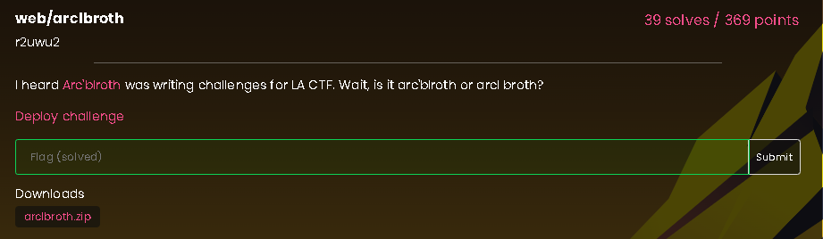
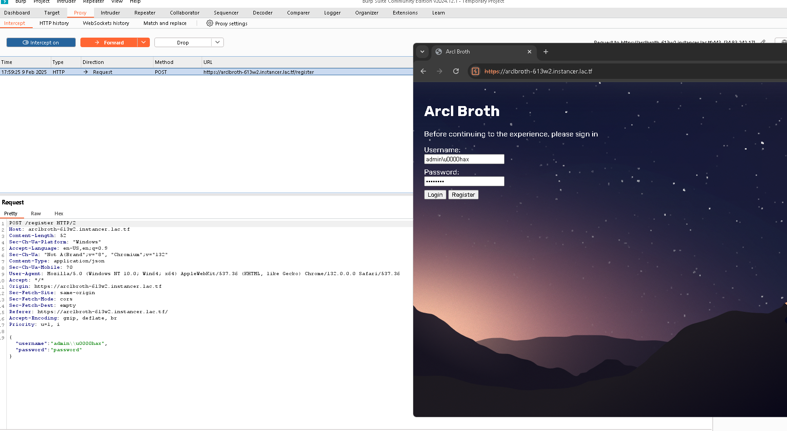
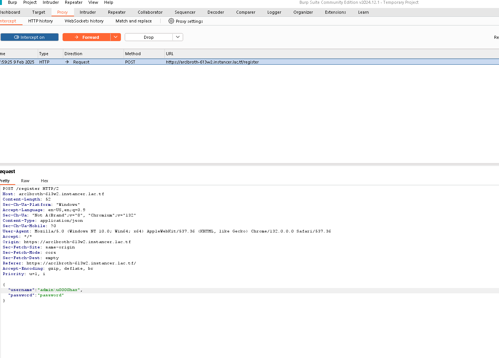
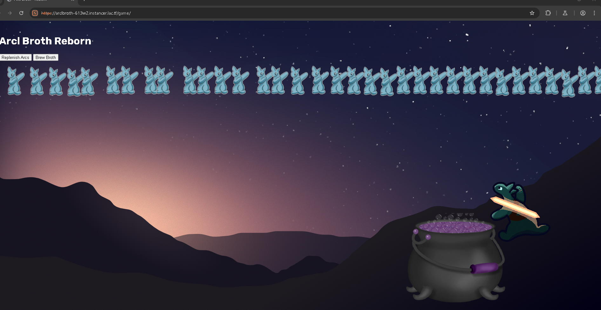
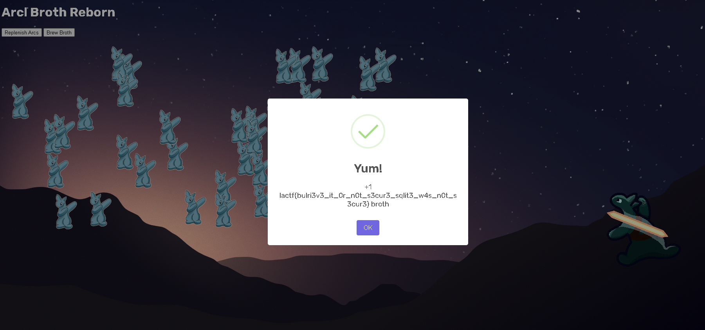

# Arclbroth Writeup

**Team: M4j4nDyn4sty**


## Overview

In this challenge, the goal was to brew a flag by exploiting vulnerabilities in a web application built with Express and SQLite. The application allowed users to register, log in, replenish their "arcs", and brew them into a broth that held the flag. However, only an admin (with 100 arcs) could brew the flag. Normal users only started with 10 arcs.


## Vulnerability

**Null Byte Injection in Registration:** By injecting a null byte into the username, I was able to bypass the duplicate check.


## Exploitation steps

1. **Intercepting the Registration Request:**

   I used Burp Suite to intercept the registration request. I attempted to register with the following credentials:

   - **Username:** `admin\u0000hax`
   - **Password:** `password`

   

2. **Correcting the Payload:**

   When I intercepted the request, I noticed that the website automatically added an extra escape character, changing the username to `admin\\u0000hax`. Before forwarding the request, I edited the payload back to:

   ```json
   {"username": "admin\u0000hax", "password": "password"}
   ```
   
3. **Logging in as Admin:**

   After registering with the credentials above, the server processed the username as admin (since SQLite stops at the null byte), then I was logged in as admin and granted 100 arcs.
   <br><br>
   
4. **Brewing the flag:**
  
   Finally, I clicked the "brew" button. With 100 arcs available, the system deducted 50 arcs and returned the flag in the response:
    `lactf{bulri3v3_it_0r_n0t_s3cur3_sqlit3_w4s_n0t_s3cur3}`
    <br><br>
   

<br><br>
<div align="center">
  <strong>Sincerely yours,</strong><br>
  <strong>Ahmed Al-Naamani (C00k1eSn4tch3r)</strong>
</div>


